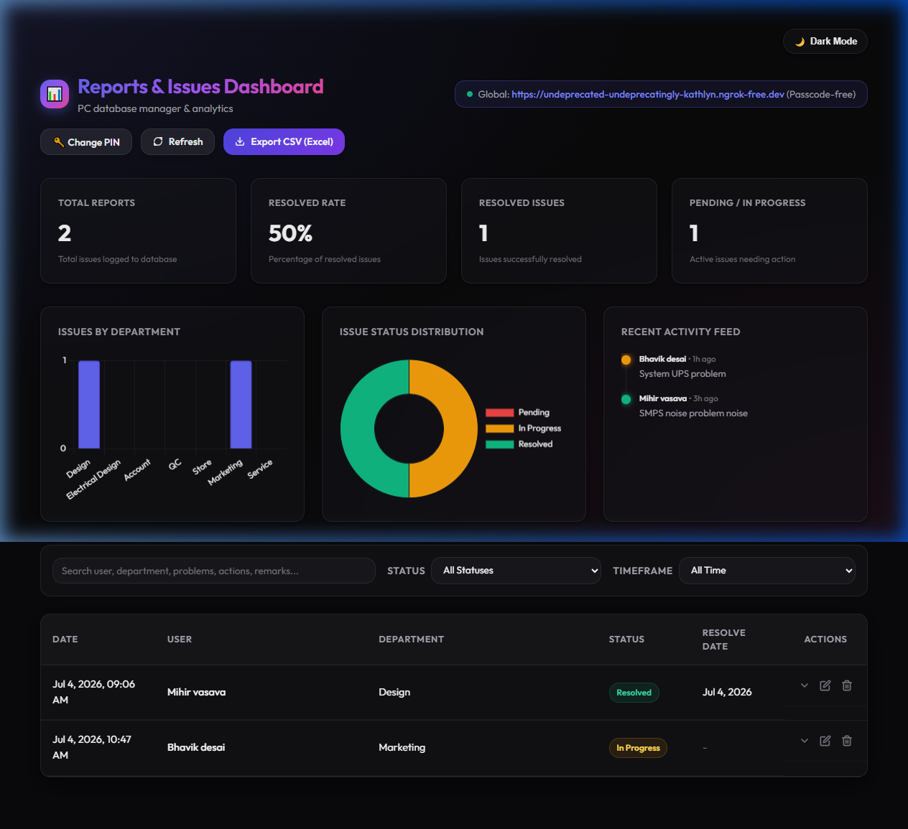
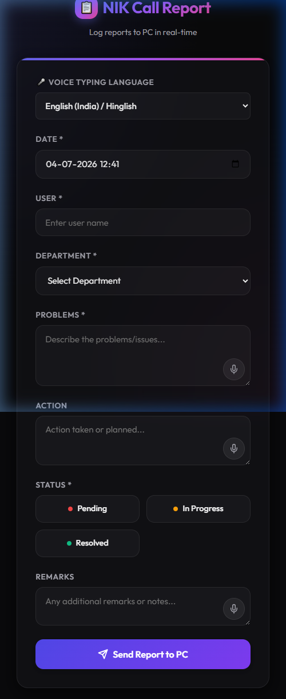

# NIK Call Logger & Issues Manager 📋

An enterprise-grade, PWA-compatible mobile call intake logger and real-time PC dashboard. Designed with Google Material Design 3 guidelines and premium glassmorphic aesthetics. 

This repository contains the complete codebase configured for instant deployment and secure programmatic tunneling. Follow the setup instructions below to clone, configure, and run this application on any computer.

---

## 🚀 Key Features

### 1. 📱 Mobile Logger Client (Offline-Ready PWA)
* **Custom Excel Fields Mapping**: Matches standard reports columns (`Date | User | Department | Problems | Action | Status | ResolveDate | Remarks`).
* **PWA Offline Mode & Background Auto-Sync**: Logs submissions locally when offline and automatically pushes them to the PC database when the connection is restored.
* **🎤 Multi-Lingual Speech Dictation**: Dynamic voice-to-text supporting **English (US)**, **English (India/Hinglish)**, and **Hindi (हिंदी)** with live soundwave animations.
* **Dual Theme Toggle**: Instantly switch between premium Dark and Light modes.

### 2. 📊 PC Dashboard Manager (Real-time Analytics)
* **KPI Metrics Tracker**: Live statistics tracking total calls, resolved rate %, and pending issues.
* **Dynamic Visualizations**: Live Doughnut & Bar charts (using Chart.js) displaying department workloads and status distribution.
* **Live Inline Database Editor**: Edit status, actions, remarks, or dates directly within the dashboard table.
* **Excel Export**: Single-click downloads of filtered log data in Excel-optimized CSV formatting (UTF-8 with BOM).

### 3. 🛡️ Advanced Security Suite
* **Cryptographic SHA-256 Hashing**: PIN passcodes are stored securely as 256-bit hashes inside `data/security_config.json` instead of plaintext.
* **Sliding Session Expiry**: Automatically logs out users after **10 minutes of inactivity** to prevent unauthorized access.
* **Anti-Spam Rate Limiter**: Restricts devices to a maximum of 60 requests per minute to block DDoS attacks.
* **Input Sanitization**: Server-side filters that strip HTML/Script tags to prevent Cross-Site Scripting (XSS) injections.

### 4. 💾 Automated Data Backups
* **Daily Cron Backups**: Creates daily timestamped copies of your JSON and CSV databases in the `data/backups/` directory whenever edits are logged.

---

## 📂 Project Structure

```
call-logger/
├── data/
│   ├── reports.json         <-- Main JSON Database (Excluded from Git)
│   ├── reports.csv          <-- Spreadsheet Database (Excluded from Git)
│   ├── security_config.json <-- Cryptographically secure SHA-256 PIN hash (Excluded from Git)
│   └── backups/             <-- Automated daily database backups (Excluded from Git)
├── public/
│   ├── index.html           <-- Mobile client page
│   ├── app.js               <-- Mobile client logic & dictation
│   ├── dashboard.html       <-- PC Dashboard page
│   ├── dashboard.js         <-- PC Dashboard filtering & CSV export
│   ├── style.css            <-- Premium shared glassmorphism styling
│   └── tunnel_info.txt      <-- Auto-generated server access details
├── server.js                <-- Node.js server and tunnel manager
├── Start_Logger_Server.bat  <-- One-click Windows startup script
└── package.json             <-- Project dependencies
```

---

## ⚙️ How to Clone & Run This Project From GitHub

Follow these steps to deploy and run the system on any PC from scratch:

### Step 1: Clone the Repository
Open Git Bash, Command Prompt, or PowerShell and clone the repository:
```bash
git clone https://github.com/nikhilsomvanshi60/Enterprise-Call-Reports.git
```

### Step 2: Navigate to Project Folder
```bash
cd Enterprise-Call-Reports
```

### Step 3: Install Node Dependencies
Download and install the required library packages (Express, Cors, Localtunnel, QRCode, etc.):
```bash
npm install
```

### Step 4: Configure Ngrok Credentials
To enable global internet access for mobile phones via your permanent Ngrok static domain:
1. Double-click the **`setup_ngrok.bat`** file inside the project directory.
2. Enter your **Ngrok Authtoken** when prompted:
   `2Upv7znBf0hv7KIm5xWWBNhddHt_2ip2HPSbcC1UXRY9AzbWM`
3. Enter your **Ngrok Static Domain** when prompted:
   `undeprecated-undeprecatingly-kathlyn.ngrok-free.dev`
4. This script automatically saves your credentials into `data/ngrok_config.json`.

---

## 🚀 Starting the Application

You can start the logger system using one of the following methods:

### Method A: One-Click Startup (Recommended for Windows)
Simply double-click the **`Start_Logger_Server.bat`** file inside the project directory. This script will:
* Launch the Express backend server.
* Bind the secure Ngrok tunnel.
* Auto-launch the PC Dashboard page (`http://localhost:3000/dashboard.html`) in your default web browser.

### Method B: Manual Startup via Terminal
Run the start command in your command line:
```bash
npm start
```
* Once started, a **QR Code** will be generated directly in the console. Scan this QR code with your mobile camera to open the application instantly on your phone!

---

## 🔒 Passcode Settings & Expiry
* **Default Login PIN**: `8989` (Required to access the dashboard and logger form).
* **Changing the PIN**: Go to the PC Dashboard, click the **🔑 Change PIN** button in the header, enter the current PIN, and set a new one. The server will automatically hash and update the configuration.
* **Auto-Logout**: Sessions automatically expire and lock after **10 minutes** of user inactivity.

---

## 📸 Screen Previews

### 1. 📊 PC Dashboard Manager (Analytics & Activity Feed)


### 2. 📱 Mobile Logger Client (Speech Localization & PWA Form)

